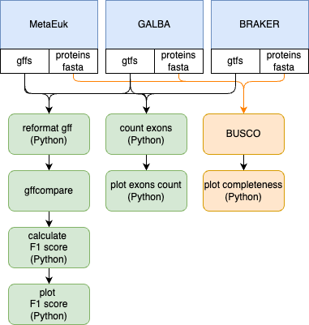

# microeuks-gene-benchmarker
Scripts to benchmark the outputs from gene annotation tools for microbial eukaryotes

## Nextflow pipeline

    

schema [source](https://app.diagrams.net/#G1DsDDTB09WNjAvT-jeIXRIcVkBU6za7l-#%7B%22pageId%22%3A%22Y0dW5HZ3BuflrP9SrEyN%22%7D)

Data:

Results example: 